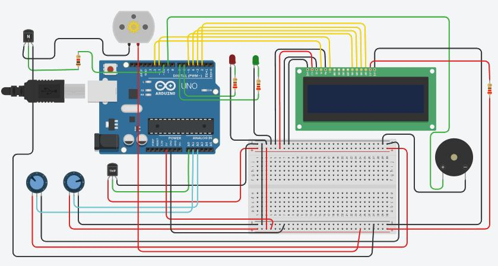
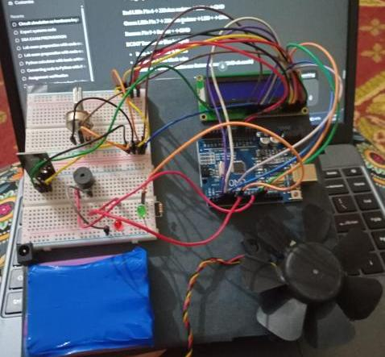

# Real-Time Environmental Monitoring System

Embedded Systems Lab Project. Arduino Uno based system that monitors temperature,
humidity, and pH in real time, with automated alerts.

**Bahria University Karachi Campus**
Electrical Engineering Department, Embedded System and Design course
Spring 2026

Team:
- Malahima Adeel (02-239232-043)
- Urooj Khan (02-239232-052)
- Shayan Ali (02-239232-068)

Submitted to: Sir Hamza Ahmed

## What It Does
- Reads real temperature from TMP36 sensor
- Simulates humidity and pH using potentiometers (TinkerCad limitation, no real sensors available)
- Displays all 3 readings live on 16x2 LCD
- Auto turns on cooling fan when temp crosses 40°C
- Buzzer + red LED alert when any value goes out of safe range
- Green LED stays on when all readings normal
- Loop refreshes every 1 second

## Components Used
- Arduino Uno
- TMP36 temperature sensor
- 2x Potentiometer (10k ohm) — simulate humidity and pH
- 16x2 LCD Display
- Piezo Buzzer
- Red LED + Green LED
- DC Motor (simulates fan, real build used 12V fan with NPN transistor + diode)
- Resistors, breadboard, jumper wires

## Threshold Logic
- Temp > 40°C → fan ON, alert ON
- Humidity > 80% → alert ON
- pH < 4 or pH > 9 → alert ON
- All normal → green LED ON

## Circuit Diagram

## Simulation Result

## Real Hardware Build

## Test Results

| Test | Temperature | Humidity | pH |
|---|---|---|---|
| Normal | 24.8°C | 66% | 7.3 |
| High Temp Alert | 93.2°C | 67% | 6.7 |
| High pH Alert | 25°C | 50% | 3.1 |

## Limitations
- Humidity and pH simulated via potentiometer, not real sensors (TinkerCad + market shortage)
- No wireless data transmission
- Fan represented by DC motor in sim, real build used 12V fan via transistor

## Future Improvements
- Replace potentiometers with real DHT11 and pH sensors
- Add WiFi/Bluetooth to send data to mobile app
